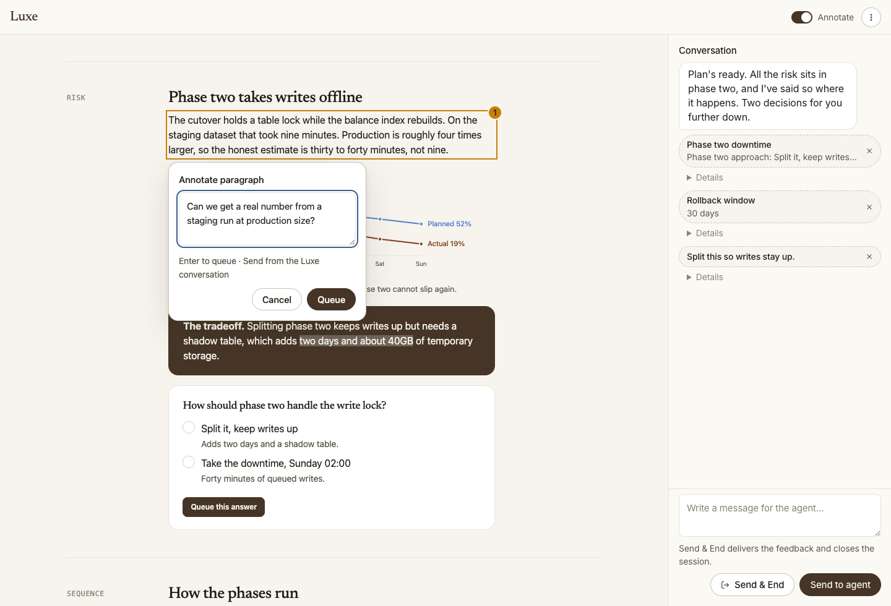
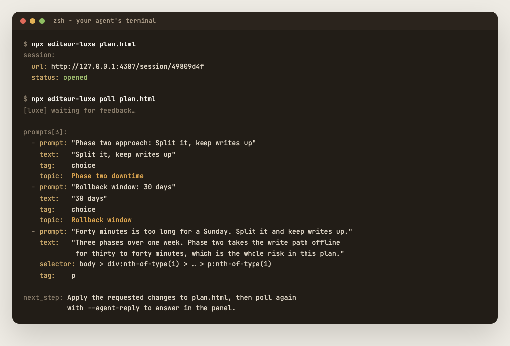

<h1 align="center">Luxe</h1>
<p align="center">
  <a href="https://github.com/snitilf/Luxe/actions/workflows/ci.yml"
    ></a>
  <a href="https://github.com/snitilf/Luxe/actions/workflows/release-please.yml"
    ></a>
  <a href="https://www.npmjs.com/package/editeur-luxe"
    ></a>
  <a href="https://img.shields.io/badge/platform-macOS%20%7C%20Linux%20%7C%20Windows-blue?style=flat-square"
    ></a>
</p>

<h3 align="center">Stop reading walls of text from your agent.</h3>

Your agent has a plan. Right now it arrives as chat prose you skim, half understand, and approve anyway.

Luxe turns it into a page: a rendered HTML artifact with real diagrams, tables, and comparisons, opened in your local browser.
You read the decision, click the part you disagree with, redraw the diagram if it's wrong, and send it back.



<p align="center"><em>What you review.</em></p>



<p align="center"><em>What your agent gets: structured prompts it can act on, not a screenshot.</em></p>

## Quick Start

```sh
npx skills add snitilf/Luxe --skill luxe
```

That is the entire setup. No npm install, no config.

Then ask for it by name, in agents that expose skills as slash commands:

```
/luxe let's discuss our plan here
```

Or just ask for anything easier to grasp visually, such as a plan, comparison, diagram, or report, and the agent loads the skill on its own.

## Why Luxe

- **Made to be read** - Luxe ships playbooks for plans, comparisons, tables, diagrams, code, and input, so the agent builds something you can scan instead of a wall of prose.
- **Point instead of describing** - Annotate any element or text range, edit rendered Mermaid diagrams as whiteboards, and send it back without leaving the page.
- **Local-first** - A local CLI and a local browser. Nothing in the loop touches a cloud service.

## Built as an AXI

Luxe is an [AXI](https://axi.md), so any capable agent can run it with nothing installed and learn it by using it.
TOON output, long polling, and contextual disclosure keep the loop cheap in context. [More on that](docs/axi.md).

## Documentation

| Page                                     | What is in it                                             |
| ---------------------------------------- | --------------------------------------------------------- |
| [Install](docs/install.md)               | The skill, the zero-setup route, and sandbox fallbacks    |
| [CLI reference](docs/cli.md)             | Every command, flag, and playbook ID                      |
| [Reviewing artifacts](docs/reviewing.md) | Annotating, shortcuts, in-page forms, Mermaid whiteboards |
| [Writing artifacts](docs/artifacts.md)   | The injected SDK, local assets, the layout gate, export   |
| [Configuration](docs/configuration.md)   | Every environment variable, with defaults                 |
| [Security](docs/security.md)             | Trust model, network exposure, and what is stored on disk |
| [Development](docs/development.md)       | Building from source and the verification commands        |

## License

[MIT](LICENSE).
